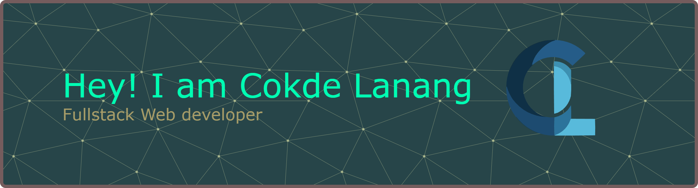

<h2 align="left">🧑‍💻 Hi, I'm Cokorda Gde Lanang Pringandana!</h2>

###

<h3 align="left">🌐 Full-Stack  Web Developer | React & Tailwind Specialist</h3>

###

I'm a passionate full-stack developer experienced in building modern web applications using React.js, TypeScript, Express.js, Tailwind CSS, and MongoDB. I enjoy creating clean, responsive, and interactive user interfaces while developing scalable, type-safe backend solutions.

###

<h2 align="left">About me</h2>

###

✨ Journey: Full-stack development (React, TS, Express) from idea to deployment.  📚 Learning: Advanced TypeScript, scalable backends, and frontend animations.  🎯 Goals: Impactful apps, Open-Source contributions, and interactive UX design.  🎲 Fun fact: Leading collaborations and experimenting with AI/ML.  💡 Passion: Full-stack logic to solve real-world user problems.

###

<h1 align="left">I code with</h1>

###

  
  
  
  
  
  
  
  
  
  
  
  
  
  
  
  
  
  
  

###

 

###

  

###

 

<picture>
  <source media="(prefers-color-scheme: dark)" srcset="https://raw.githubusercontent.com/Lanang38/Lanang38/output/pacman-contribution-graph-dark.svg">
  <source media="(prefers-color-scheme: light)" srcset="https://raw.githubusercontent.com/Lanang38/Lanang38/output/pacman-contribution-graph.svg">
  
</picture>

###
